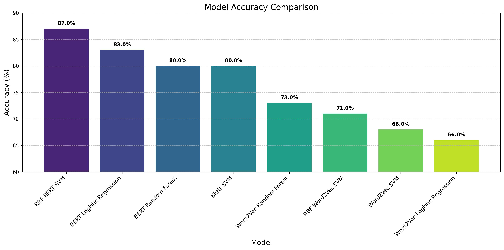

# Email Classification Project

## Introduction
This project aims to provide a gateway to a more effective solution for email categorization. Today, most email classification systems focus on broad categories like spam, junk, or promotional emails. However, our goal is to enable a more meaningful categorization—distinguishing between work-related emails, personal messages, and more.

In particular, within the work category, we aim to further refine classification by organizing emails into specific, meaningful subcategories. Using the Enron dataset as our foundation, we focus on developing a structured approach to classify work-related emails into distinct and relevant categories, enhancing both accessibility and efficiency in email management.

## Setup Instructions

To run this project, follow these steps:

1. **Clone the repository** and navigate into the project folder.  
2. **Download the dataset** from [this link](https://drive.google.com/file/d/1EFNkUdb5xn3rF1gaxctTjpUybhtUYt07/view?usp=sharing) and place it in the main project folder.  

   The folder structure should look like this:

   MLEmails/
   ├── Figure/
   ├── BertEmbedding.py
   ├── Create_Word2Vec.py
   ├── DataProcessing.py
   ├── emails.csv # Place the downloaded file here

## Dataset & Preprocessing

The dataset initially contained approximately 500,000 emails, stored in various folders that served as initial labels. However, we identified that some folders lacked clear semantic focus, leading to inconsistent labeling and dataset imbalance. To improve data quality:

We removed generic folders such as 'Inbox,' 'Calendar,' and 'Junk File,' which contained disproportionately large numbers of emails but lacked meaningful distinctions.

We removed folders with very few emails, as they were unsuitable for training a robust classification model.

The dataset was significantly reduced, dropping from 500,000 emails to 64,512. To address this, we targeted folders with a significant number of emails and related names, combining them into 9 categories that we deemed fitting as labels for the emails. These categories were chosen based on their semantic relevance and the volume of emails they contained, ensuring a more balanced and meaningful dataset for our exploration of email categorization.

After examination, we dropped 2 categories: It and  Archive and Miscellaneous folders, as they lacked semantic relevance, leaving us with the following folders as categories:
personal, hr, meetings and scheduling, operations and logistics, projects,corporate and legal, finance.

The final dataset for model training consisted of 14,081 emails.

### Emails were preprocessed by:

Cleaning subject lines.

Standardizing text formats.

Removing stopwords and unnecessary metadata.

## Labels
Owing to the fact that the emails in Enron dataset(emails.csv) are already organized into their respective folders, we leveraged word embeddings on the folder names to enhance our analysis. This approach was particularly effective because the folder names inherently capture the context and categorization of the emails. To streamline the process, we performed significant manual work to consolidate similar folders. For instance, folders like HR, HR_r, and HR_recruiting were combined into a single category, HR.
This approach not only preserved the organizational structure of the emails but also allowed us to leverage the semantic meaning embedded in the folder names, providing a robust foundation for our machine learning pipeline.
The final categories, which now serve as our labels, are as follows:

Personal

HR

Meetings and Scheduling

Operations and Logistics

Projects

Corporate and Legal

Finance

These labels provide a structured framework for analysis, enabling us to derive actionable insights and build robust machine learning models. Each of the 14,081 emails was assigned to one of these categories, ensuring that every email is associated with a clear and meaningful label. These labels not only reflect the content and context of the emails but also serve as the foundation for supervised learning tasks, such as classification and clustering.

### Why These Labels?

**Personal**(numeric value 0): Emails related to individual or non-work-related communication.

**HR**(numeric value 1): Emails pertaining to recruitment, employee relations, and human resources management.

**Meetings and Scheduling**(numeric value 2): Emails about meeting coordination, calendars, and scheduling.

**Operations and Logistics**(numeric value 3): Emails concerning supply chain, logistics, and operational workflows.

**Projects**(numeric value 4): Emails tied to specific initiatives, project management, and collaborative efforts.

**Corporate and Legal**(numeric value 5): Emails involving legal matters, compliance, and corporate governance.

**Finance**(numeric value 6): Emails related to budgeting, trading, and financial operations.

By using these categories as labels, we ensure that our dataset is not only well-organized but also primed for advanced analytical tasks, such as predictive modeling and semantic analysis. This approach allows us to leverage the inherent structure of the data while maintaining its contextual richness.

## Features
1.**Content Length** – The total length of the email body.

2.**Number of Recipients** – The count of recipients in the email.

3.**Email Subject Embedding** – A numerical representation of the email subject.

4.**Email Body Embedding** – A numerical representation of the email body.

For the last two features, we experimented with different embedding techniques. Initially, we used Word2Vec, but the results were not satisfactory. To improve performance, we turned to BERT (Bidirectional Encoder Representations from Transformers). The difference was significant, as demonstrated in the figures.

## Data Visualizations

  
  

BERT embeddings demonstrate superior clustering of email data compared to Word2Vec, with more distinct and meaningful groupings visible in the PCA visualization. While Word2Vec shows scattered, overlapping distributions, BERT's contextual understanding creates clearer separation between categories, particularly for label 2, suggesting it captures more nuanced semantic relationships in email content.

  
  

The addition of a third dimension in PCA visualization further highlights the differences between embedding techniques. In the 3D space, Word2Vec (Image 1) continues to show predominantly scattered data with orange label 0 dominating, while the BERT visualization (Image 2) reveals even more distinct separation between clusters, particularly for the red label 2 points which form a cohesive region with some outlier groups. This enhanced separability in three dimensions reinforces BERT's superior ability to capture semantic relationships in email data, as the contextual embeddings maintain their structural integrity across multiple principal components, suggesting BERT would likely provide better performance for downstream classification tasks.

  
  

As we have observed, the t-SNE technique does not break the insights from the PCA analysis; instead, it reinforces them.

# Hypothesis

The t-SNE and PCA visualizations reveal the inherent complexity of our email embedding space. As we compare Word2Vec and BERT representations through both dimensionality reduction techniques, a clear pattern emerges. The data exhibits significant non-linear characteristics with intricate cluster structures that resist simple separation.

BERT embeddings consistently demonstrate superior cluster formation compared to Word2Vec, with more defined boundaries between email categories. This is particularly evident in the t-SNE visualizations, where BERT's contextual understanding creates distinctive satellite clusters and clearer separation for other categories. 

Word2Vec, while showing some clustering tendencies, produces more overlapping distributions with less defined category boundaries.
Model Selection Implications
Given the non-linear separability and high dimensionality of these embeddings, simpler models like Logistic Regression would indeed struggle to establish effective decision boundaries. 

The complex interrelationships between data points require algorithms capable of modeling non-linear patterns across multiple dimensions.
SVM with RBF kernel stands as a more promising approach, as it can project the data into higher-dimensional spaces to find separation planes invisible in the original feature space.

Its ability to capture intricate patterns makes it well-suited for classifying the semantically rich representations that BERT produces.

These visualizations strongly suggest that leveraging BERT embeddings with non-linear classifiers would yield the most effective email categorization system, capitalizing on both the quality of the representation and the classifier's ability to establish appropriate decision boundaries in complex feature spaces

A significant challenge emerges when examining the "Personal" category within our email classification framework. Unlike work-specific categories with distinctive terminology and contexts, personal communications encompass a wide spectrum of topics and language patterns.

This breadth of content creates substantial overlap with other categories in the embedding space.

We anticipate that classifiers will face particular difficulty establishing clear boundaries around the personal category, potentially misclassifying work-related emails that contain casual language or general topics.

This classification uncertainty represents a significant challenge that may reduce overall model performance, even when using BERT's superior embeddings with advanced non-linear classifiers.

## Machine Learning Models Used
To classify emails effectively, we experimented with multiple models:

### Multi Class Logistic Regression

Multi-class Logistic Regression is expected to underperform compared to other models due to the high dimensionality of our dataset and the lack of clearly separable classes. Given the complex nature of our features, linear decision boundaries may struggle to capture meaningful distinctions between categories, leading to suboptimal classification performance.

### Random Forest

Random Forest is expected to perform well due to its robustness to overfitting and capture complex decision boundaries. By aggregating multiple decision trees, it reduces overfitting and improves generalization. Additionally, its ensemble nature helps mitigate the impact of noisy or overlapping data, making it a strong candidate for classification in our dataset.

### Support Vector Machine

Support Vector Machines (SVM) are expected to perform reasonably well, especially with the right kernel choice.
Given our high-dimensional data, SVM with a nonlinear kernel (such as RBF) can effectively capture complex decision boundaries by mapping the data into a higher-dimensional space where it becomes more separable. The RBF kernel transforms the input space using a similarity measure based on distance, allowing it to handle intricate patterns that a linear kernel would struggle with. This makes it particularly useful when class distributions overlap or when relationships between features are highly nonlinear.

## Key Findings & Impact

### Multi Class Logistic Regression

  
 

Logistic Regression performed surprisingly well with BERT embeddings, achieving 83% accuracy—outperforming even BERT-based Random Forest (80%). This suggests that despite its linear nature, Logistic Regression can still be effective when paired with high-quality embeddings. However, its performance dropped significantly with Word2Vec (66%), highlighting the importance of embedding choice. The results indicate that while Logistic Regression struggles with complex decision boundaries, strong feature representations can still enhance its effectiveness.

  
  

Comparing the training loss curves, Word2Vec plateaus at a significantly higher value (around 0.95) than BERT (around 0.3), indicating BERT's superior ability to minimize error on the training data. While Word2Vec shows a steady but limited decrease in loss that flattens early, BERT demonstrates a steeper initial decline followed by continued improvement throughout training, reflecting its more powerful representational capacity to capture complex linguistic patterns in the text data that Word2Vec cannot effectively model.

### Random Forest

 
  

 
 

The data reveals a clear relationship between embedding quality and classifier effectiveness. Random Forest performed best with Word2Vec (73% accuracy), leveraging its ensemble approach, but was outperformed by RBF SVM (87%) and Logistic Regression (83%) with BERT embeddings. This suggests BERT's rich contextual features favor linear or kernel-based methods over tree-based approaches. While Random Forest benefits from improved embeddings, it still struggles with certain nuanced distinctions, which kernel methods like RBF SVM handle more effectively. Overall, as embeddings improve, the classifier's ability to leverage that richness becomes the key factor in performance.

### Support Vector Machine

#### Linear SVM

 
  

 
 

The Linear SVM performed poorly on both Word2Vec and BERT embeddings, struggling to capture the complexity of the classification task. However, as observed earlier, the BERT-based model still outperformed its Word2Vec counterpart, reinforcing the idea that high-quality embeddings significantly impact model effectiveness. While SVMs can be powerful in well-structured feature spaces, their linear decision boundaries likely struggled to separate the nuanced relationships within the dataset, particularly when using weaker Word2Vec representations.

#### SVM With RBF Kernel

 
  

 
 

The RBF kernel SVM emerged as the top-performing model with BERT embeddings, surpassing all others, and delivered strong results even with Word2Vec, outperforming nearly every alternative. This highlights the power of the RBF kernel in capturing complex, non-linear relationships that simpler models, like Linear SVM or Logistic Regression, struggle with. Unlike linear models, which rely on straight decision boundaries, the RBF kernel maps data into a higher-dimensional space, allowing it to better separate intricate patterns within the dataset. Its success across both embedding types emphasizes the crucial role of kernel methods in enhancing classification performance, particularly when dealing with high-dimensional, text-based data.

### Accuarcy Comparision of all models

## Conculsion:

Based on the comprehensive analysis and experimental results presented in this email classification project, we can draw several significant conclusions:

1.**Embedding Quality is Paramount**: BERT embeddings consistently outperformed Word2Vec across all classifier types, demonstrating that high-quality contextual embeddings are fundamental to effective email classification. The superior clustering and separation visible in both PCA and t-SNE visualizations translated directly to better classification performance.

2.**The Critical Interplay Between Embeddings and Classifiers**: Different classifiers leveraged embedding quality differently. While Random Forest performed best with Word2Vec embeddings (73% accuracy), it was surpassed by both RBF SVM (87%) and even Logistic Regression (83%) when using BERT embeddings. This suggests that as embedding quality improves, the classifier's ability to utilize that richness becomes the limiting factor.

3.**Non-linear Methods Excel**: The RBF kernel SVM emerged as the standout performer, achieving 87% accuracy with BERT embeddings. Its ability to map data into higher-dimensional spaces and establish complex decision boundaries proved ideal for capturing the nuanced semantic relationships in email content.
Challenging Categories Persist: As hypothesized, the "Personal" category remained challenging to classify cleanly, with significant overlap with other categories. Similarly, the "Projects" category showed consistently lower performance across models, likely due to its diverse and overlapping content with other work-related categories.

4.**Beyond Linear Boundaries**: The initial hypothesis that Logistic Regression would struggle due to non-linear separability was partially supported. While it performed poorly with Word2Vec (66%), it surprisingly excelled with BERT embeddings (83%), indicating that high-quality embeddings can sometimes compensate for model limitations.

5.**Practical Applications**: The project demonstrates that effective email categorization into meaningful work-related subcategories is achievable with modern NLP techniques, particularly when using contextual embeddings like BERT combined with appropriate classification algorithms.

This research provides a foundation for developing more sophisticated email management systems that can automatically organize messages into semantically meaningful categories, ultimately enhancing productivity and information accessibility in professional environments.

## Future Improvements

### Diversify Data Sources

Our current reliance on the Enron dataset, while valuable, limits our model's exposure to primarily corporate communications from a single company culture. To build a more robust and generalizable email classification system, we recommend:

**Expand Domain Coverage**: Incorporate email data from diverse organizational environments:

Academic institutions: Faculty communications, research collaborations, and administrative correspondence

Healthcare organizations: Professional medical communications while maintaining strict privacy compliance

Public sector: Government agencies and public service communications.

Technology firms: Technical discussions and project management from different technology cultures
Non-profit organizations: Mission-driven communications with different priorities and workflows

**Enhance Category Representation**: With broader data sources, we can develop more nuanced and universally applicable category definitions that accurately reflect communication patterns across industries.

**Temporal Diversity**: Include more recent email data to capture evolving communication styles, modern terminology, and contemporary workplace practices that might differ significantly from the early 2000s Enron dataset.

### Integrate Advanced Algorithms

Explore Complex Models: While we have utilized algorithms like Random Forest, DBSCAN, Logistic Regression (LG), and Support Vector Machines (SVM), there is potential to integrate more sophisticated models such as:

Gradient Boosting Machines (GBM): For improved predictive accuracy.

XGBoost/LightGBM: Efficient and scalable implementations of gradient boosting.

Neural Networks: Deep learning models for capturing complex patterns.

Ensemble Methods: Combine multiple models to enhance performance.

Hyperparameter Tuning: Optimize the parameters of these algorithms to achieve better results.

### Enhance Word Embeddings
Experiment with Embedding Techniques: Explore various word embedding algorithms to better capture semantic relationships in the data. Some options include:

GloVe: Global Vectors for word representation.

FastText: For capturing subword information.

Domain-Specific Embeddings: Train embeddings on domain-specific corpora to better fit the nuances of different sectors.

### Improve Data Quality and Preprocessing

Data Cleaning: Implement more rigorous data cleaning techniques to handle missing values, outliers, and inconsistencies.

Feature Engineering: Create more informative features that can enhance model performance.

